# Quizeo
Quizeo is a web-based quiz application that allows users to create, manage, and take quizzes. It supports user authentication, quiz creation, and the ability to track quiz progress. 
This application is designed to help users create personalized quizzes and share them with others.nner.

## Features
- User Authentication: Users can register, log in, and manage their profile.
- Quiz Creation: Users can create custom quizzes, add questions, set difficulty levels, and define time limits.
- Start Quizzes: Users can start quizzes and answer multiple-choice questions.
- Track Progress: Users can view their quiz scores after completing the quiz.

## Getting Started

### Prerequisites
- [Node.js ](https://nodejs.org/en) 
- [MongoDB](https://www.mongodb.com/products/platform/atlas-database): use MongoDB Atlas for cloud hosting or install MongoDB locally.
  

## Installation

Clone the repository:
```bash
  git clone https://github.com/your-username/quizeo.git
```
Navigate into the project directory:
```bash
cd quizeo
```
Install the required dependencies:
```bash
npm install
```
Create a .env file in the root of the project and add the following configuration:
```bash
JWT_SECRET=your-jwt-secret
MONGO_URI=mongodb://your-mongo-uri
```
Start the server:
```bash
node index.js
```

## License
This project is licensed under the MIT License - see the LICENSE file for details.

## Notes
- Replace your-username with your actual GitHub username in the clone URL.
- Customize the JWT_SECRET and MONGO_URI in the .env section according to your environment.
- You can add more detailed instructions depending on any additional setup required for your project (e.g., running MongoDB locally, specific configuration steps).

  ## Screenshots

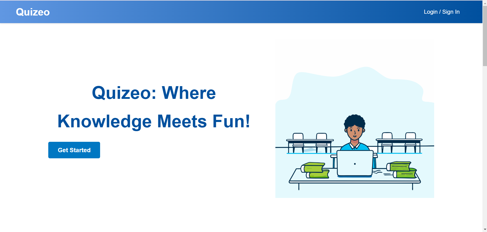
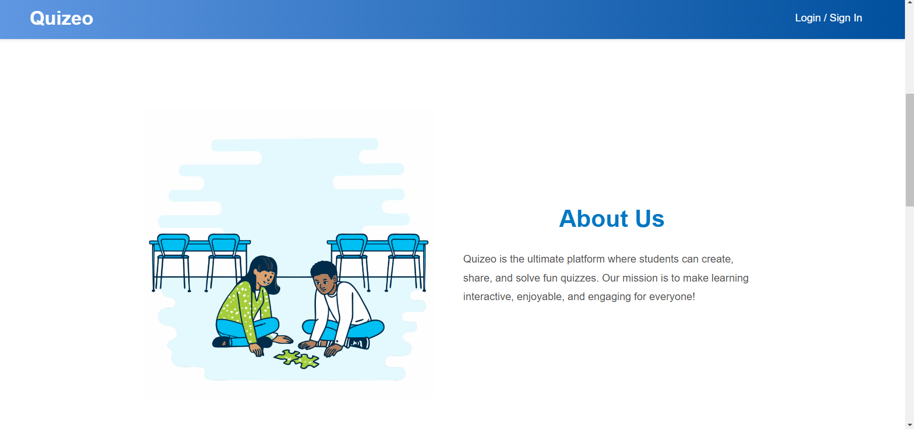
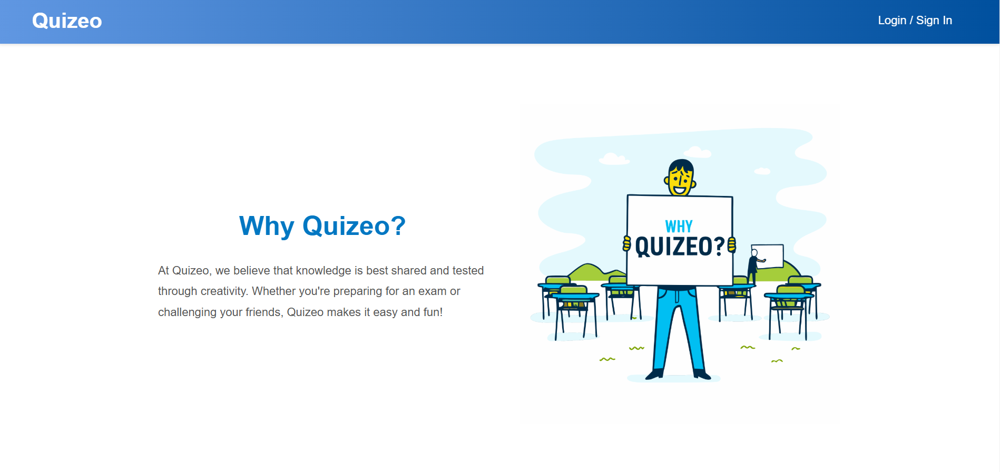
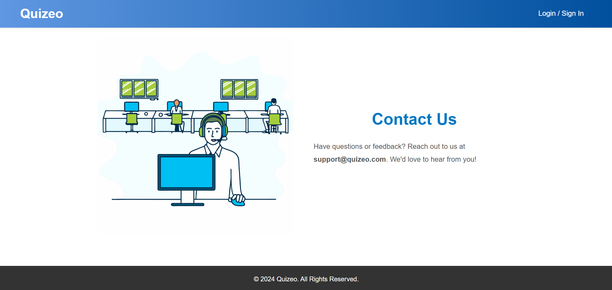
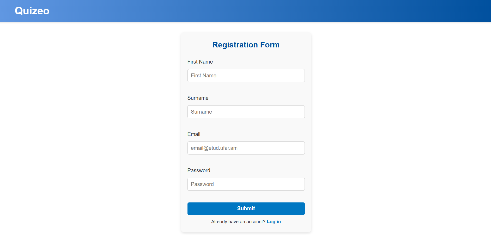
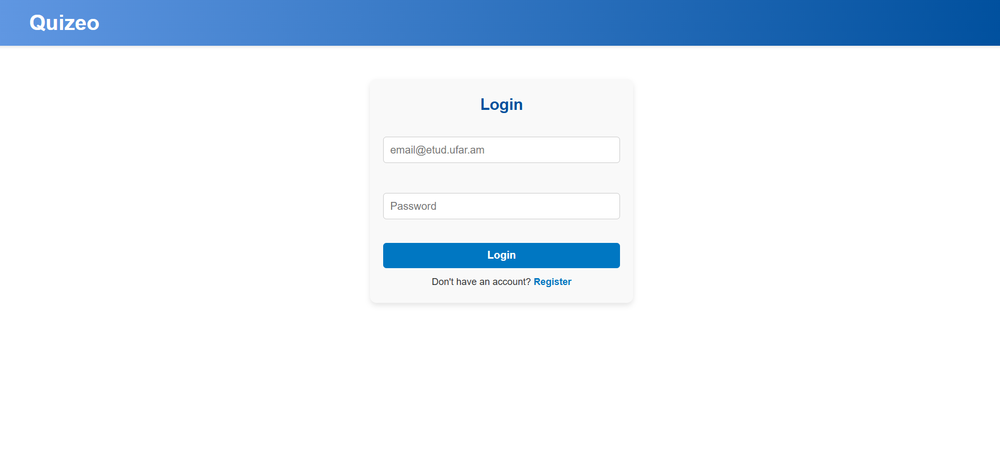
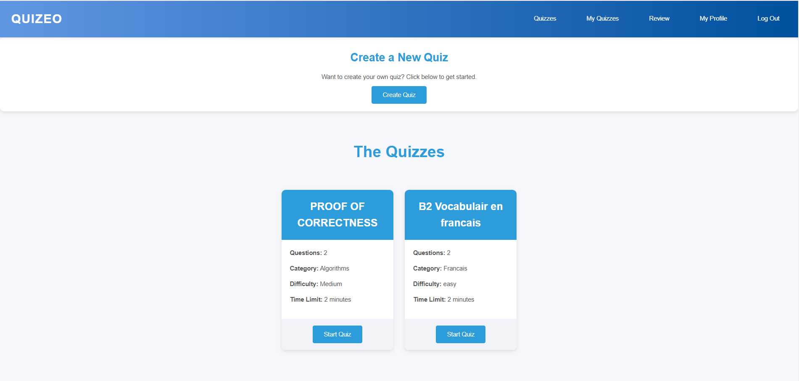
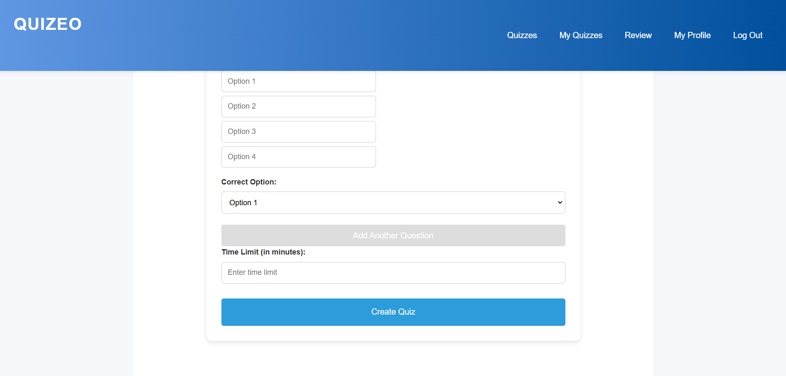
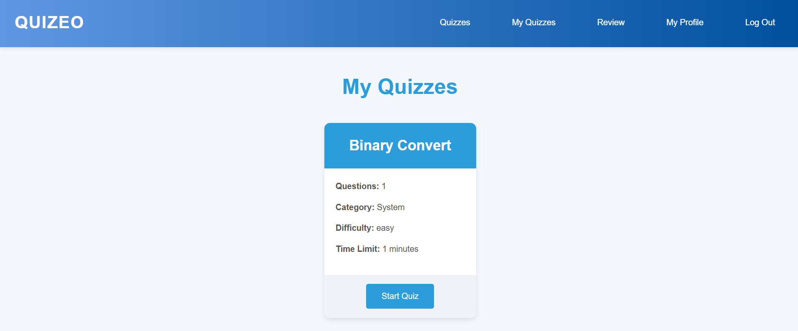
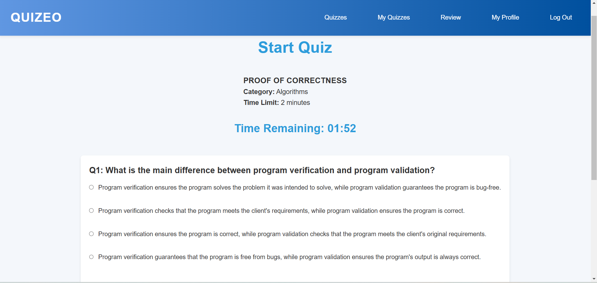
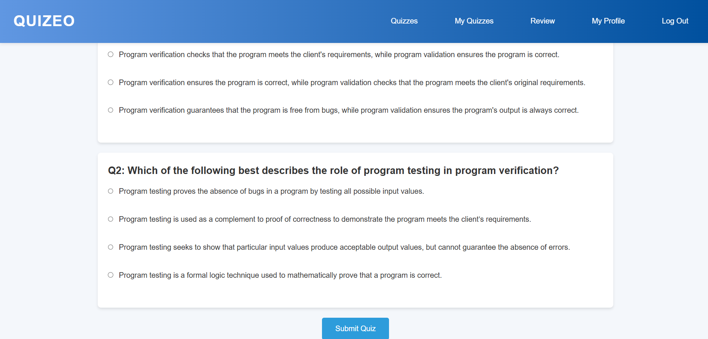
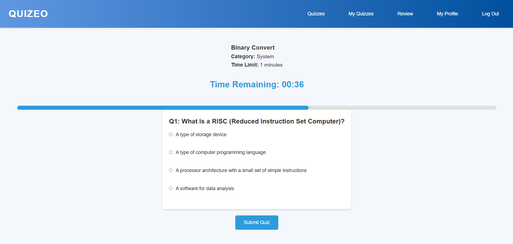
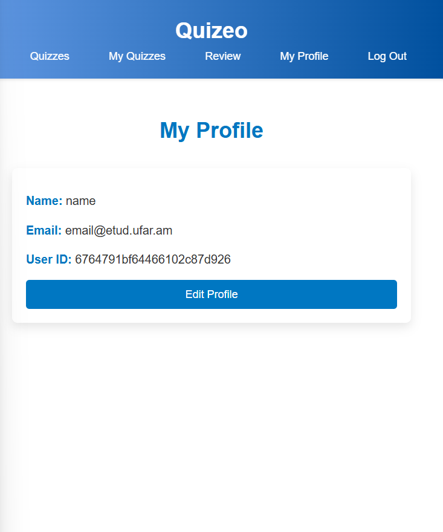
